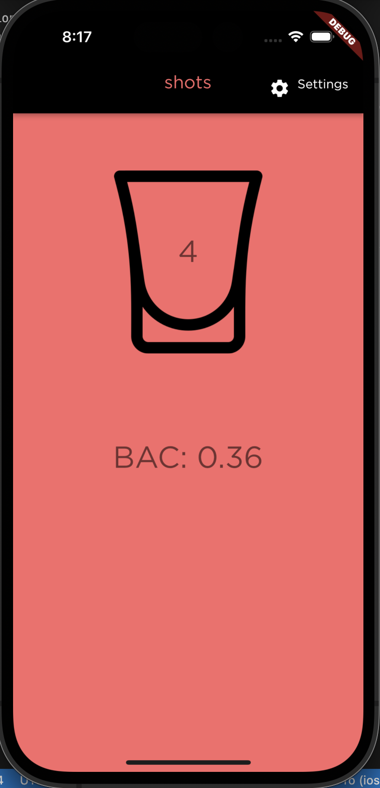
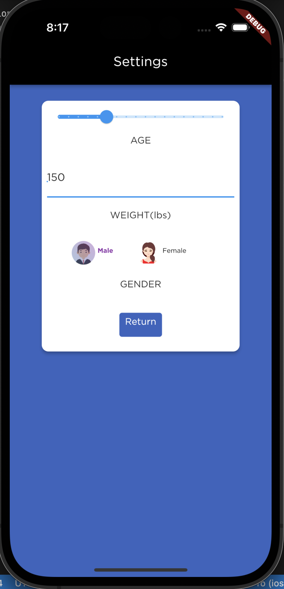

# shots
A mobile application powered by Google's Flutter framework, designed to track users alcohol consumption and promote safe drinking!
The application can be served/downloaded on Android, iOS, Mac, and Chrome based devices to reach as many users as possible.

 


## Motivation


At the University of Maryland, in spite of the countless drinking prevention campaigns, 3/4 of students regularly consume alcohol. Rather than continuing this ineffective campaigns it is vital that the university provides resources to make these inevitable drinking experiences safer. 

Oftentimes students get caught up in the moment and dont accurately track the amounts of drinks they have had. Circumstances like this can lead to student's experiencing the [snowball effect](https://en.wikipedia.org/wiki/Snowball_effect) and get carried away with how much they are drinking. This snowball effect can lead to students reaching dangerous BAC levels that pose serious health risks. **shots** is designed to prevent this snowball effect and keep students safe!


## Description
**shots** contains a variety of different features which are meant to maximize the users safety to prevent alcohol poisoning and other harmful side effects of drinking. The app is a seamless solution to many of these health concerns and aims to be a proactive solution rather than a reactive. The app's primary functionality is to count the users drink intake and maintain a timer between drinks to caution the user. Alongside this the application calculates their [Blood Alcohol Content](https://vaden.stanford.edu/super/learn/alcohol-drug-info/reduce-your-risk/what-blood-alcohol-concentration-bac) based on the [Widmark Formula](https://www.denisekirbylaw.com/dwi-faqs/who-is-widmark-and-what-is-his-equation/) and displays it on the home screen. 

The application intially queries users for different characteristics such as age, gender, and weight in order to calibrate the BAC calculations. Upon reaching harmful BAC levels the application will alert the user as well as contact their emergency contact which they can configure in settings. The application will send the contact a message alerting them of the users high BAC levels and a location pin in emergency cases.

Since users of the application will be intoxicated **shots** also darkens the background color of the application proportional to the users BAC in order to serve as a visual indicator. This visual can alert friends nearby of how much the user has drank and serve as an early alarm system.
<center>
<div style="float:left;">

</div>

<div>

<break>


</break>
</div>
</center>


## Getting Started

### Dependencies

* Flutter
* Dart
* AndroidStudio
* XCode + tools
* materialUI for dart

### Installing

```
git clone https://github.com/amruth21/shot_counter
```

### Setting up Dependencies

Dependencies are automatically listed in the pubspec.yaml file and must be installed using
```
flutter pub get
```

### Executing program

Launch either Android Studio simulator or XCode simulator and run the following in your terminal
```
flutter run
```

### Importing to phone
TBA


## Authors

Amruth Nare (amruthnare.1@gmail.com) completed on March 25, 2023

## MIT License
